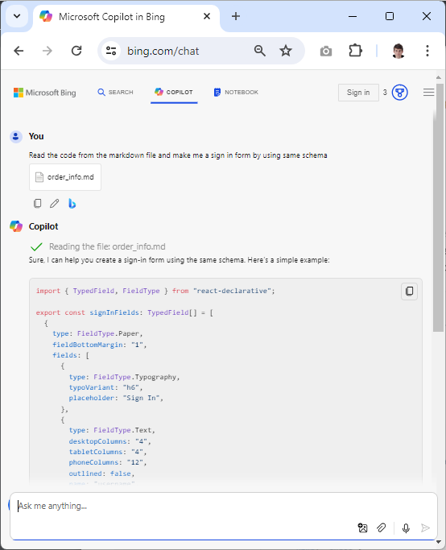

# ⚛️ ChatGPT React Generator

> The ChatGPT app which write a JSX form for [React-Vite](https://vitejs.dev/) application

A ChatGPT powered React Code Generator. Specify what kind of React form you want to build and directly get the code and a live preview.

## Contribute

> [!IMPORTANT]
> Made by using [react-declarative](https://github.com/react-declarative/react-declarative) to solve your problems. **⭐Star** and **💻Fork** It on github will be appreciated

## How It's Work

1. The [postinstall.mjs](./scripts/postinstall.mjs) file download `Nous-Hermes-2-Mistral-7B` [LLM](https://en.wikipedia.org/wiki/Large_language_model)

2. The [index.mjs](./index.mjs) file generate RAW `./tmp.txt` according to [SYSTEM_PROMPT](./assets/SYSTEM_PROMPT.txt) and [USER_PROMPT](./assets/USER_PROMPT.txt)

3. The [index.mjs](./index.mjs) transform markdown in `./tmp.txt` to jsx in `./src/out/index.jsx` according to [TRANSFORM_PROMPT](./assets/TRANSFORM_PROMPT.txt)

4. The Vite server start the UI on `http://localhost:3000`

## Usage

1. Run `npm install`

2. Edit [USER_PROMPT](./assets/USER_PROMPT.txt)

3. Run `npm start` to generate the code. Will take a couple of minutes if running on CPU. GPU require at least 16Gb embedded RAM

4. Run `npm run test` to launch the code
